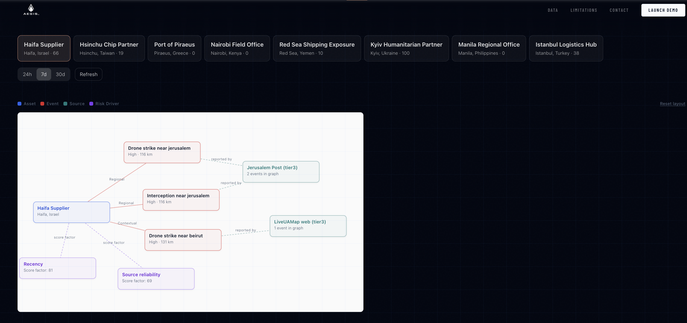
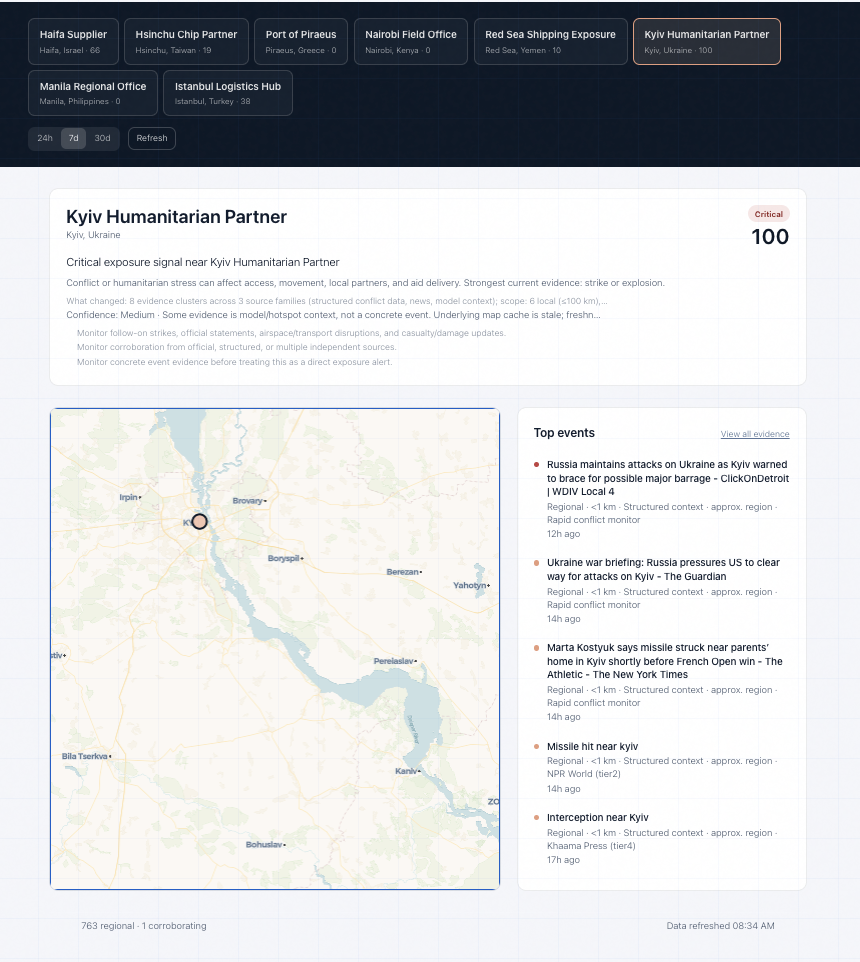
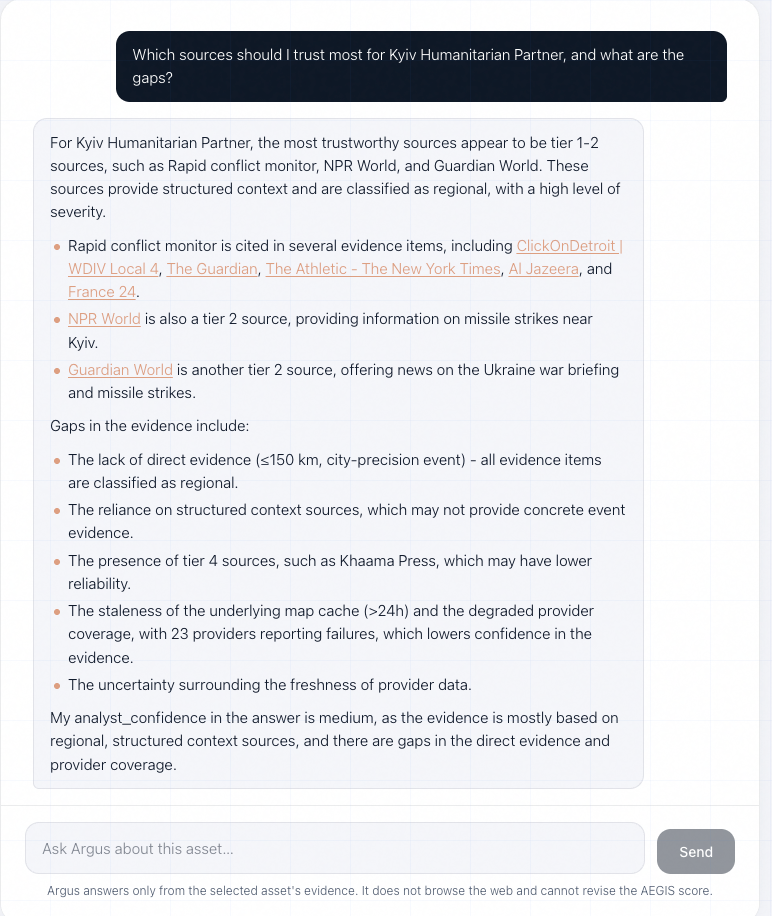

# AEGIS — Geopolitical Early-Warning & Strategic Intelligence Platform

AEGIS is an asset-centered geopolitical intelligence and escalation monitoring platform designed to analyze global instability, infrastructure exposure, conflict escalation, and emerging strategic risk.

## Live Platform

[Launch AEGIS](https://aegis-hq.com)

Built with Next.js and TypeScript, the platform combines geospatial visualization, structured event ingestion, evidence pipelines, and analyst-facing workflows into a unified operational intelligence interface.

---

## Platform Preview



*Asset relationship and event-correlation network view.*

---



*Asset-centered operational dashboard with regional risk monitoring and corroborating event evidence.*

---



*Analyst reasoning workflow evaluating source reliability, evidence quality, and intelligence gaps.*

---

## Core Capabilities

- Asset-centered Impact analysis focused on exposure, escalation relevance, and regional context
- Interactive geospatial monitoring using layered global event and intelligence data
- Multi-source ingestion pipelines combining structured conflict, disaster, humanitarian, and contextual intelligence feeds
- Evidence and corroboration workflows designed to improve explainability and reduce noise
- Analyst-oriented interfaces for reviewing escalation signals, regional developments, and strategic context
- Integrated AI-assisted analysis workflows for summarization, interpretation, and operational support

---

## Current Architecture

The current implementation includes:

- Next.js + TypeScript frontend application
- Interactive mapping and geospatial visualization
- Structured source ingestion pipelines
- Neon/Postgres-backed data infrastructure
- UCDP conflict ingestion support
- Analyst chat and evidence interfaces
- Source quality and relevance scoring systems
- Modular ingestion architecture for future intelligence and data providers

---

## Running Locally

```bash
npm install
npm run dev
```

Then open:

```bash
http://localhost:3000
```

---

## Environment Variables

Copy `.env.example` to `.env.local` and configure the required environment variables for your deployment environment.

---

## Deployment

1. Push the project to GitHub
2. Import the repository into Vercel
3. Configure required environment variables
4. Deploy the application

---

## Technology Stack

- Next.js
- TypeScript
- React
- MapLibre / Geospatial Visualization
- Neon Postgres
- Vercel
- Groq API
- TailwindCSS

---

## Roadmap

- Advanced map clustering and layered visualization
- Expanded infrastructure and supply chain risk modeling
- Regional baseline conflict and instability overlays
- Improved evidence explainability and source confidence scoring
- AI-assisted escalation analysis and forecasting workflows
- Additional structured intelligence source integrations
- Enhanced analyst collaboration and operational workflows

---

## Disclaimer

AEGIS is an independent research and engineering project focused on geopolitical analysis, escalation monitoring, and operational intelligence workflows.

The platform is experimental and should not be treated as an authoritative intelligence or forecasting system.
